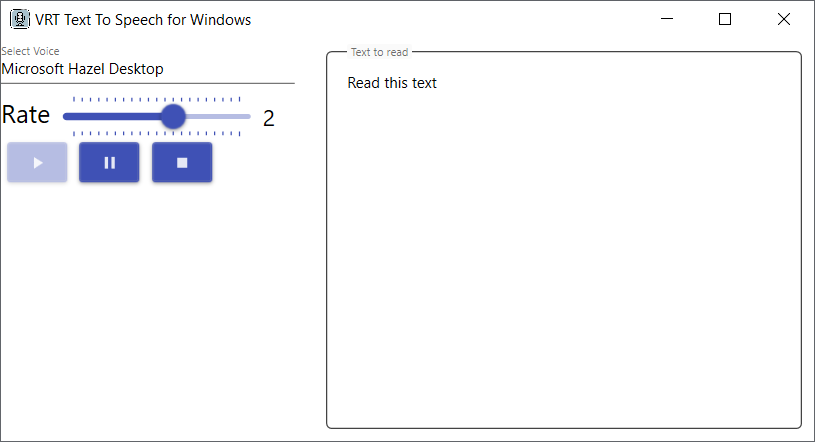

# Text To Speech App
This application converts Text To Speech using Voices installed in Your Windows operating system.

## Installation Instructions
You will need to build the project to create an executable file.
In the project directory, run this command at the command line:

    dotnet publish -c Release --self-contained false

Copy items from publish directory and place it in the directory of your desire. Double-click the exe file to execute the application.

## System requirenments
  * Windows 10 (it should also work well on Windows 7 and 11 - not tested)
  * .NET Runtime 6.0.2 (**https://dotnet.microsoft.com/en-us/download/dotnet/6.0**)
  
## Current Features
 * Converts Text from the Text field into Speech and send it to default output audio device 

## Possible Ideas
 * Write Speech into audio file
 * Save current state (Text and Progress) when application closes and restore it after application starts
 * Save current user configuration
