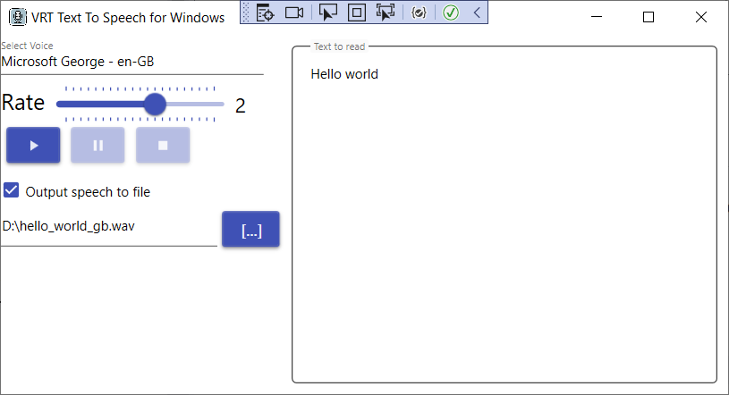

# Text To Speech App
This application converts text to speech with the help of voices installed in the Windows operating system.



## Installation Instructions
You will need to build the project to create an executable file.
In the project directory, run this command at the command line:

```dotnet publish -c Release --self-contained false```

or if you prefere less number of dll-s, then you can use the following command:

```dotnet publish -c Release -p:PublishSingleFile=true --self-contained false -r win-x64```

Copy items from publish directory and place it in the directory of your desire. Double-click the exe file to execute the application.

## System requirenments
  * Windows 10 (it should also work well on Windows 7 and 11 - not tested)
  * .NET Runtime 6.0.2 (**https://dotnet.microsoft.com/en-us/download/dotnet/6.0**)
  
## Current Features
 1. Converts text in text box to speech. Then sends it to the default audio output device,
 1. Saving of speech to an audio file.

## Possible Ideas 
 * Save current state (Text and Progress) when application closes and restore it after application starts
 * Save current user configuration
